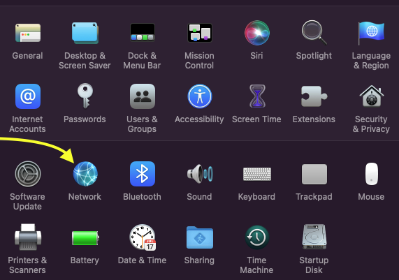
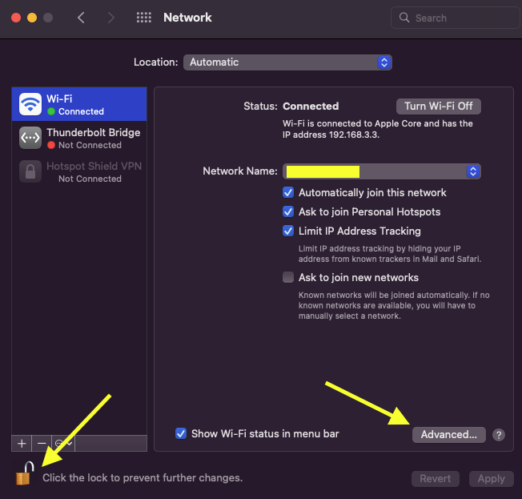
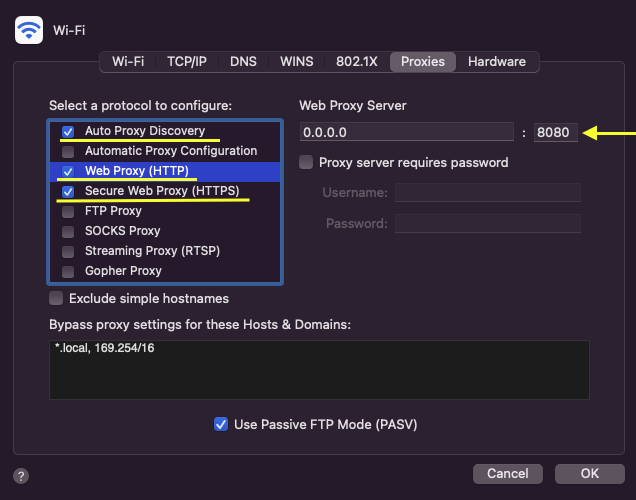
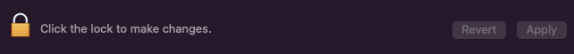

# protected-proxy

Use `node proxy.js` to start the server.

If you have MacOS, add your proxy to your system Network Preferences:

- Open Network Pref on your device
  

- Click on the Lock to make changes and push the `Advanced...` button:
  

- Go to `Proxies` menu and set configure `Auto Proxy Discovery` or Manualy(HTTP and HTTPS with entering Proxy Server host and port), click `OK` to save changes:
  

- Click `Apply` button and then Lock changes:
  

Enjoy safely internet surfing ;)
